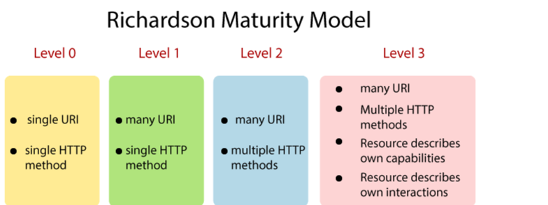

# ReST

Representational State Transfer (REST) is a software architecture that imposes conditions on how an API should work.  
Following are the principles of a Restful APIS:

1. Uniform interface
   - Uniform interface principle states that server should transfer information in a standard format(ResponseBody) which differs from 
        the way data is stored in the server. Uniform interface principle imposes 4 constraint.
  
        - Every resource in server can be uniquely identified by using uniform resource identifier.
        - Clients have enough information in the resource representation to modify or delete the resource if they want to. 
          The server meets this condition by sending metadata that describes the resource further. 
        - Clients receive information about how to process the representation further. The server achieves this by sending
          self-descriptive messages that contain metadata about how the client can best use them.
  In simpler words, REST defines a consistent and uniform interface for interactions between clients and servers.
  For example, the HTTP-based REST APIs make use of the standard HTTP methods (GET, POST, PUT, DELETE, etc.) and the URIs (Uniform Resource Identifiers) to identify resources.
2. Client-Server
   - The client-server design pattern enforces the separation of concerns, which helps the client and the server components evolve independently.
3. Statelessness mandates that each request from the client to the server must contain all of the information necessary to understand and complete the request.
   Session is maintained by client, not server.
4. Cacheable
    - Responses can be cacheable based on the request body.
5. Layered System
   - A client calls a server. But internally there may be many layers in Server,making call to different servers. But for client it is invisible.
6. Code on Demand
   - In some cases, server can send a code snippet to be executed by client.

URI: Unifrom Resource Indentifier
HTTP Methods: 

    GET: The GET method retrieves a representation of the specified resource.
    POST: A POST request transmits data to the server.(Creation)
    PUT: The PUT method replaces all existing representations of the resource.
    PATCH: A PATCH request makes partial changes to a resource.
    DELETE: The DELETE method removes the specified resource.

level 0
These APIs use only one URI and one HTTP method called POST. In short, it exposes SOAP web services in the REST style.

level 1
When an API can distinguish between different resources, it might be at level 1. It uses multiple URIs but 1 http header

level 2
vel 2 indicates that an API must use the protocol properties to deal with scalability and failures. 
At level 2, correct HTTP verbs are used with each request.

level 3
HATEOAS

**Idempotency in APIs**
- Idempotent implies that a certain operation can be applied many times, without changing the result.
Get,PUT is by default idempontent.
- Add a unique identifier in request to make it idempotent.

