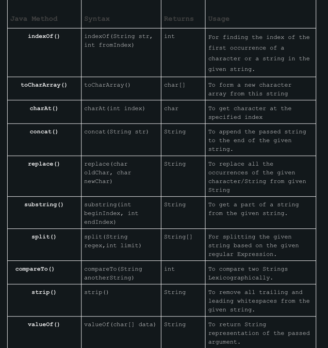

## String Functions

1. trim() -> removes extra spaces in start and end of string
2. split(d) -> function takes a string d and uses it as a delimiter. Using it, it will
               return a array of strings
3. length() -> length of the string.




### StringBuilder
    - Manily used for modifaction of string quickly but not thread safe.

```
StringBuilder builder = new StringBuilder();
builder.append("Java");
builder.applend("Guide");

builder.insert(4, " "); // Inserts space between Java and Guides

builder.delete(0, 4); // Removes the word "Java"
builder.reverse(); // Reverses the content
builder.length();

builder.setLength(5); // Sets the length to 5
char ch = builder.charAt(5);
builder.setCharAt(5, 'g');
substring(int start) and substring(int start, int end) 
indexOf(String str) and lastIndexOf(String str)
deleteCharAt(int index) 
```