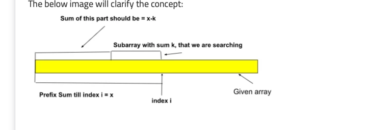

**Duplicate in an array**

    Q) Given an array of integers nums containing n + 1 integers where each integer is in the range [1, n] inclusive.
    
    There is only one repeated number in nums, return this repeated number.
    
    You must solve the problem without modifying the array nums and uses only constant extra space.

**Prefix sum approach**
Q) Find largest subarray of sum k. elements can be negative.

- Idea is to iterate & keep adding sum. if prefixSum == k then you have your answer.
  Also keep storing the prefix sum in a hashmap with index i. Now find x = prefixSum - k. 
  If x is present in hasMap, it means there exist a a subArray of sum k ending at that particular index i.
