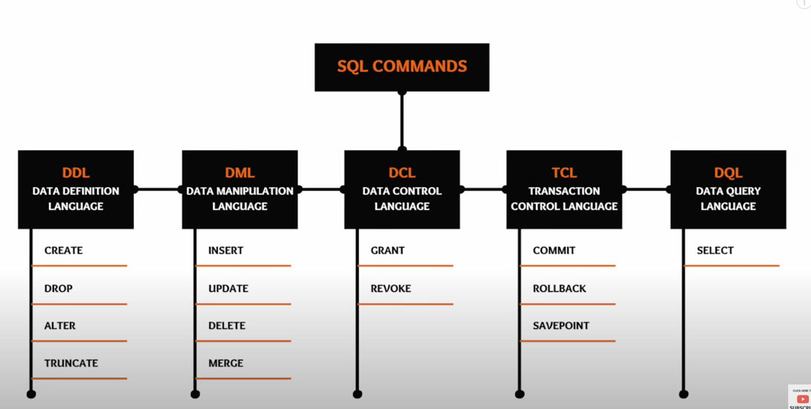

SQL queries



1. SELECT

```
SELECT * FROM employees WHERE Salary > 55000.00;
```


2. CREATE Table
   ```
   CREATE TABLE IF NOT EXISTS Employee (
   EmployeeID int,
   FirstName varchar(55),
   LastName varchar(55),
   Email varchar(150),
   DOB date
   );
   ```
   


3. Insert Values [DML]

```
INSERT INTO employees (employee_id, first_name, last_name, department, salary)
VALUES
  (1, 'John', 'Doe', 'HR', 50000.00),
  (2, 'Jane', 'Smith', 'IT', 60000.00),
  (3, 'Alice', 'Johnson', 'Finance', 55000.00),
  (4, 'Bob', 'Williams', 'IT', 62000.00),
  (5, 'Emily', 'Brown', 'HR', 48000.00);
```

4. Update 

```
UPDATE table_name 
SET coulmn_name = <value>
WHERE x = Y 

```


4. Update

```
UPDATE table_name 
SET coulmn_name = <value>
WHERE x = Y 

```

5.  DELETE
```dtd
DELETE FROM table_name
WHERE x = y
```
6. CASE
```

SELECT STAFF_ID, SALARY

, CASE WHEN SALARY >= 10000 THEN 'High Salary'

       WHEN SALARY BETWEEN 5000 AND 10000 THEN 'Average Salary'

       WHEN SALARY < 5000 THEN 'Too Low'

  END AS RANGE

FROM STAFF_SALARY

ORDER BY 2 DESC;

```

7. Find Second oldest person in the table

```
SELECT * 
FROM Customers
ORDER BY age DESC
LIMIT 1 OFFSET 2;

SELECT MAX(salary) 
FROM Customers
where salary != (Select Max(Salary) from Customer)

```

TABLE Schema

e_id | name | department | Salary
1    | A  |  CSE | 10k
2   |  B  | IT  | 2k

8. Write a Query to find count of all employees department wise

hint: grouping of rows uses group by.  Always remember group by column
is mandatory to be used in select staatement. We can use other columns with agg. function

Select Department, count(e_id)
WHERE Emp
Group by Dept


9. Write a Query to find all dept where count of employee > 2

SELECT dept 
FROM emp
Group by dept having count(*) > 2

10. Write query to find highest salry dept wise and name of the employee

Select e_name, salary
from emp 
where( dept, salary) IN (
Select dept, MAX(salary)
From emp
GROup BY dept)

10. Join Query

SELECT T1.c1 , t2.c2
FROM table1 as T1
INNER JOIN table2 as T2
ON t1.c3 = t2.c4
WHERE t1.c4 > 100