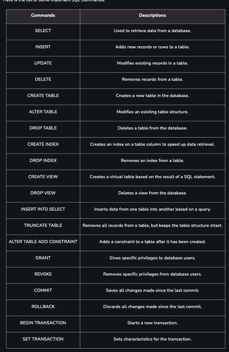

SQL queries

1. SELECT


```
SELECT * FROM employees WHERE Salary > 55000.00;
```



2. CREATE Table
   ```
   CREATE TABLE IF NOT EXISTS Employee (
   EmployeeID int,
   FirstName varchar(55),
   LastName varchar(55),
   Email varchar(150),
   DOB date
   );
   ```
   


3. Insert Values

```
INSERT INTO employees (employee_id, first_name, last_name, department, salary)
VALUES
  (1, 'John', 'Doe', 'HR', 50000.00),
  (2, 'Jane', 'Smith', 'IT', 60000.00),
  (3, 'Alice', 'Johnson', 'Finance', 55000.00),
  (4, 'Bob', 'Williams', 'IT', 62000.00),
  (5, 'Emily', 'Brown', 'HR', 48000.00);
```
