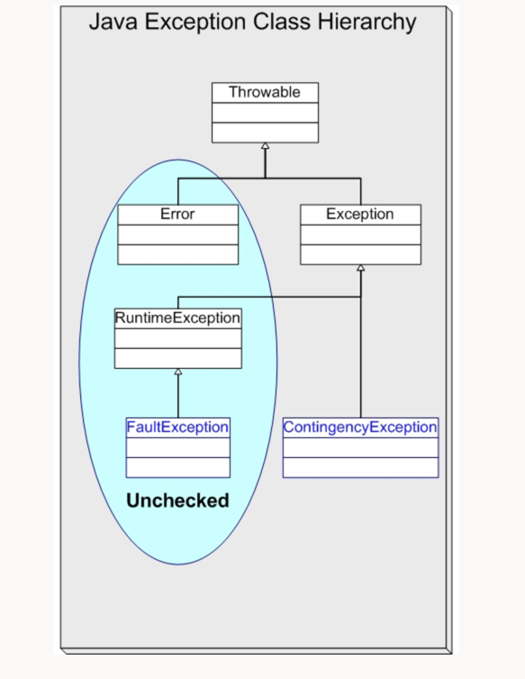

# Java Exceptions

Runtime Exception
 - These are unchecked Exceptions
Compile Time Exceptions
 - These are checked Exceptions. Require explicit handling with try catch and throws

Java came up with the Approach of checked exceptions so that client is aware of the behaviour of the code and handle the
Exception appropriately. For eg. FileNotFound. Maybe somehow deleted the file while reading it. We can handle the exception
and ask user to re enter the file name. But this creates an issue if not used judiciously. For. IOException, nothing can be done
as it is unrecoverable.

https://www.oracle.com/technical-resources/articles/enterprise-architecture/effective-exceptions-part1.html
https://stackoverflow.com/questions/27578/when-to-choose-checked-and-unchecked-exceptions

Checked Exceptions should be used for predictable, but unpreventable errors that are reasonable to recover from.

Unchecked Exceptions should be used for everything else.

