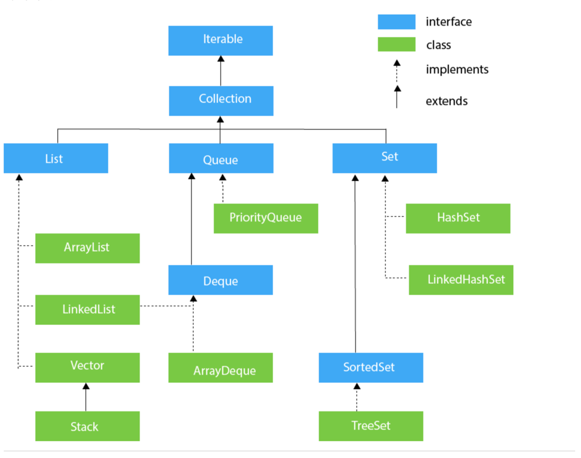
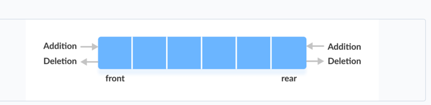

DataStructure in Java

Commons functions of List interface

-  size();
- isEmpty();
- add()
- remove()
- contains()
- set(index, elemtent)
- indexOf(Object o)

class ArrayList

- get(index i)

Interface Queue

- add()/offer() - add in rear
- peek() - peek at head
- poll()- remove at head
- 
Interface Deque

Addition and Deletion at both the end

- addFirst()
- addLast()
- peekFirst()
- peekLast()
- pollLast()
- pollFirst()

**** Use this for Stack ****

Here are the methods the Deque interface provides to implement stack:

push() - adds an element at the beginning of deque
pop() - removes an element from the beginning of deque
peek() - returns an element from the beginning of deque

class LinkList implements List, Deque

- All methods of List, Queue, Deque

