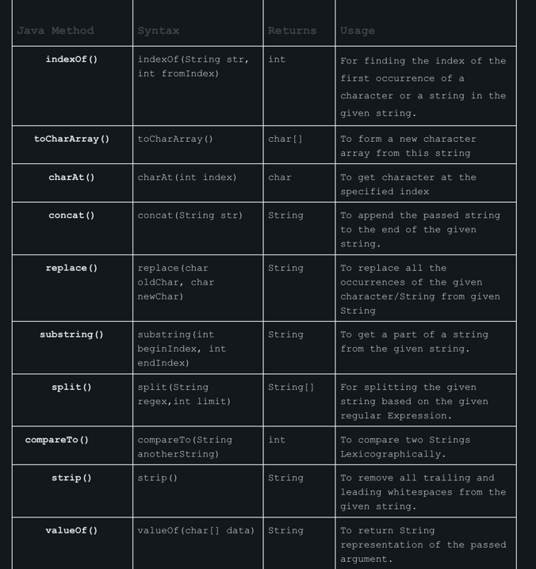

## String Functions

1. trim() -> removes extra spaces in start and end of string
2. split(d) -> function takes a string d and uses it as a delimiter. Using it, it will
               return a array of strings
3. length() -> length of the string.




### StringBuilder
    - Manily used for modifaction of string quickly but not thread safe.

```
StringBuilder builder = new StringBuilder();
builder.append("Java");
builder.applend("Guide");

builder.insert(4, " "); // Inserts space between Java and Guides

builder.delete(0, 4); // Removes the word "Java"
builder.reverse(); // Reverses the content
builder.length();

builder.setLength(5); // Sets the length to 5
char ch = builder.charAt(5);
builder.setCharAt(5, 'g');
substring(int start) and substring(int start, int end) 
indexOf(String str) and lastIndexOf(String str)
deleteCharAt(int index) 
```
Interview Questions 

- Final, finally, finalize keywords
- garbage collection
  - Algorithm of gc
  - memory leaks 
  - Young gen and old gen memory leaks
- Project code quality
- Monitoring tools of Spring application
- Integrate mysql with SPringboot
- covert microservice to Serverless architecture
  - Cloud, docker, monolith to 
- Springboot Exceptions
  - ControllerAdvice global exceptionHandling.
- Qualifier annotation, Primary Annotaion
- Aspect oriented programming

- Comparator and Comparable
  - Comparable is implemented by a class and then when can define behavior
  - of sorting.
  - Whereas a different class can implement Comparator, take 2 objects of same type and
  - define which one is bigger. This is used as Lamda in Sort function.

```
class Abc implements Comparable<Abc>{
  int age;
  
  int compare(Abc t) {
  this.age - t.age;
  }
  
}

or

list.sort((a,b) -> a.age - b.age)


```