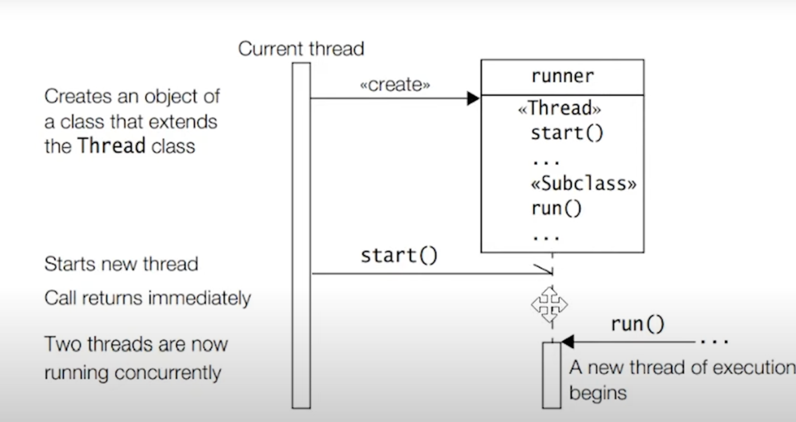

- Multi tasking
  - multiple tasks done parallely.
  - Mutli - process
    - Chrome and VLC media player running parallel
  - Multi threading
    - MS word -> typing and formtting and grammer check. 
    - Multiple threads of a process execute parallelly, Each thread share the memory of process but have a separate 
    - stack memory.

Threads also share some resources:

Text area – contains the machine code that is executed.
Data area – we use it for initialized and uninitialized static variables.
Heap – reserved for the dynamically allocated variables and is located at the opposite end of the stack in the process’s virtual address space.

Concurrently Vs Parallelism

Above image shows how Runnable interface works when creating a new thread

Above image shows how Thread class works on creating a new Thread.

