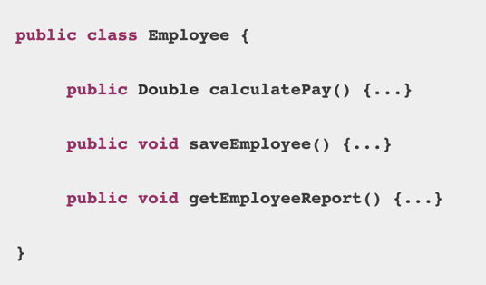
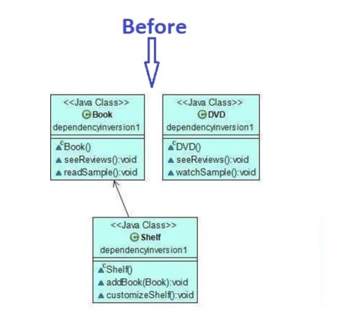
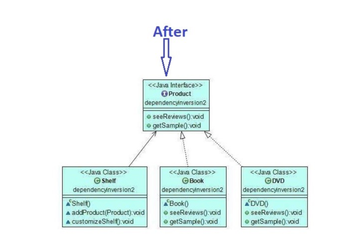

# SOLID Principles

<p> This document is made to verse my memory from time to time whenever needed. I will add less theory but more example
and hints so that I remember these concepts for long and it will be easy to retain.</p>

## S -> Single Responsibility
### A class must have only 1 reason to change.

    ###
    class UserService {

        calculateMarks() {
        // find Marks.
            // calculate average.
            // call a API to transfer average marks
            }
    }
    
    ###

ex2 



# OPEN CLOSE PRINCIPLE

```
class DisplayMessage() {

    fun(object: Object) {
    switch(object is) {
        classA: console.log()
        classB: console.log()
        classC: console.loh()
        } 
    }
}

```

-> Better version is


```
    class ParentClass {
    handle();
    }
    classA extends ParentClass {
    handle()
    }
    classB extends ParentClass {
    handle()
    }
    
    fun(object: Parent) {
    object.handle();
    }
```

## LISKOV Subsituition PRINCIPLE

-  Child class should not be more restrictive and break the contract of the parent.
-  The principle defines that objects of a superclass shall be replaceable with objects of its subclasses without breaking the application. That requires the objects of your subclasses to behave in the same way as the objects of your superclass. 

```
class Bird {
    void fly();
    void swim()
}

class ADuck extends Duck {
    fly() {
        throw NoFlyExecption()
    }
    swim() {
    console.log("Yes")
    }
}

class BDuck extends Duck {
 fly() {
    console.log("Yes");
 }
 swim() {
    throw RuntimeException();
 }
}

this is wrong.


rather

interface SwimBehavour {
        void swim()
}

interface FlyBehavoiur{
        void fly()
}

class ADuck implments SwimBehvaiour
class BDuck implemetns FlyBehaviour
```

## Interface segregation

```
interface Clock {
    void setAlarm(Instant instant);
    float readThermometer();
    void tuneInToRandomRadio();
}
-> these are functionality of new age clock. But AcienctClock() implments Clock will not have all the functionality

interface Thermometer {
get temp()
}
inteface radio {}
interface Alarm {}
inteface Clock{}
class AncientClock implements Clock, Alarm
class ModernClock implements Clock, Radio, Thermo

```


## Dependecy Inversion Principle
- High level modules should NOT depend on low level modules. It should depend on abstractions than concrete class.

```
class Books {
String id;

String Reviews()
int Rating()
}

class Shelf {
List<Book> books;

addBook();
removeBook();
}
```
High-level modules should not depend on low-level modules; both should depend on abstractions.

```
interface Product {
Reviews()
Ratings()
}
class Books implements Products {
String id;

String Reviews implements Products()
int Rating()
}

class Shelf {
List<Product> products;

addBook();
removeBook();
}
```




